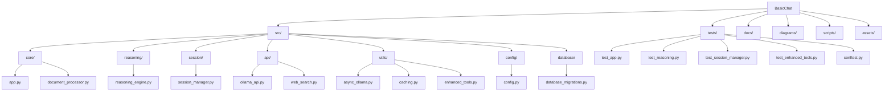
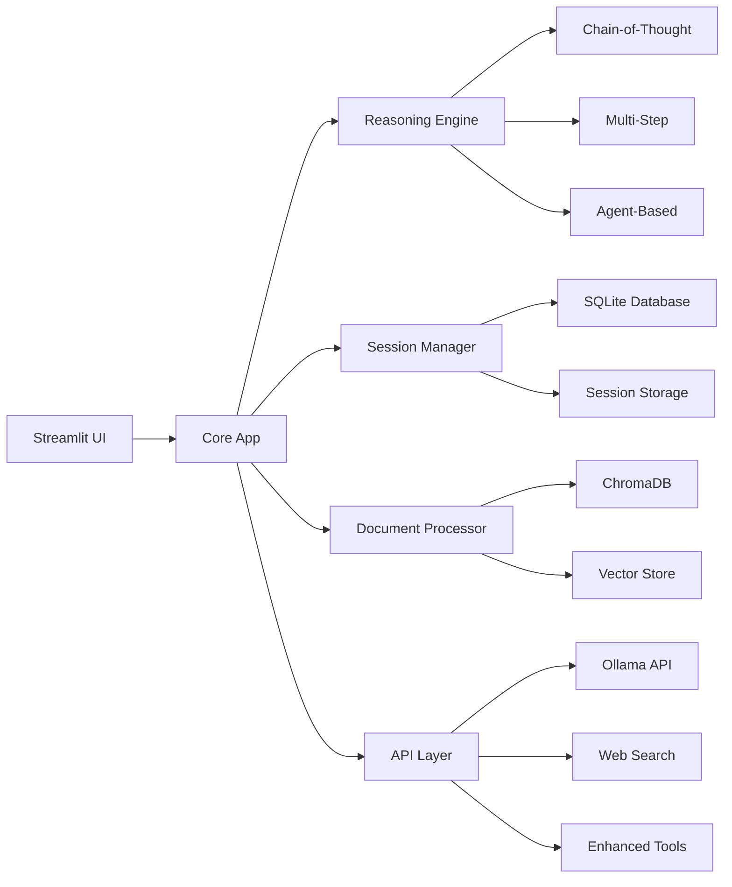
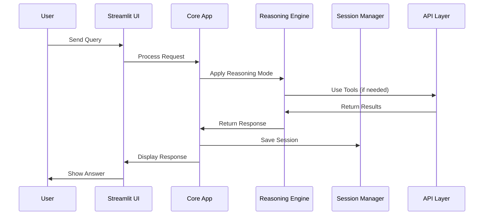
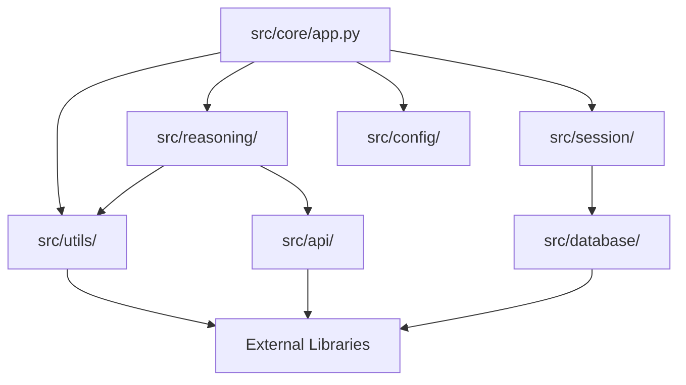

# BasicChat Architecture

## Project Structure

```mermaid
graph TD
    A[BasicChat] --> B[src/]
    A --> C[tests/]
    A --> D[docs/]
    A --> E[diagrams/]
    A --> F[scripts/]
    A --> G[assets/]
    
    B --> B1[core/]
    B --> B2[reasoning/]
    B --> B3[session/]
    B --> B4[api/]
    B --> B5[utils/]
    B --> B6[config/]
    B --> B7[database/]
    
    B1 --> B1A[app.py]
    B1 --> B1B[document_processor.py]
    
    B2 --> B2A[reasoning_engine.py]
    
    B3 --> B3A[session_manager.py]
    
    B4 --> B4A[ollama_api.py]
    B4 --> B4B[web_search.py]
    
    B5 --> B5A[async_ollama.py]
    B5 --> B5B[caching.py]
    B5 --> B5C[enhanced_tools.py]
    
    B6 --> B6A[config.py]
    
    B7 --> B7A[database_migrations.py]
    
    C --> C1[test_app.py]
    C --> C2[test_reasoning.py]
    C --> C3[test_session_manager.py]
    C --> C4[test_enhanced_tools.py]
    C --> C5[conftest.py]
```

## Component Architecture

```mermaid
graph LR
    A[Streamlit UI] --> B[Core App]
    B --> C[Reasoning Engine]
    B --> D[Session Manager]
    B --> E[Document Processor]
    B --> F[API Layer]
    
    C --> C1[Chain-of-Thought]
    C --> C2[Multi-Step]
    C --> C3[Agent-Based]
    
    D --> D1[SQLite Database]
    D --> D2[Session Storage]
    
    E --> E1[ChromaDB]
    E --> E2[Vector Store]
    
    F --> F1[Ollama API]
    F --> F2[Web Search]
    F --> F3[Enhanced Tools]
```

## Data Flow

```mermaid
sequenceDiagram
    participant U as User
    participant UI as Streamlit UI
    participant C as Core App
    participant R as Reasoning Engine
    participant S as Session Manager
    participant A as API Layer
    
    U->>UI: Send Query
    UI->>C: Process Request
    C->>R: Apply Reasoning Mode
    R->>A: Use Tools (if needed)
    A->>R: Return Results
    R->>C: Return Response
    C->>S: Save Session
    C->>UI: Display Response
    UI->>U: Show Answer
```

## Module Dependencies

```mermaid
graph TD
    A[src/core/app.py] --> B[src/reasoning/]
    A --> C[src/session/]
    A --> D[src/config/]
    A --> E[src/utils/]
    
    B --> F[src/api/]
    B --> E
    
    C --> G[src/database/]
    
    E --> H[External Libraries]
    F --> H
    G --> H
``` 